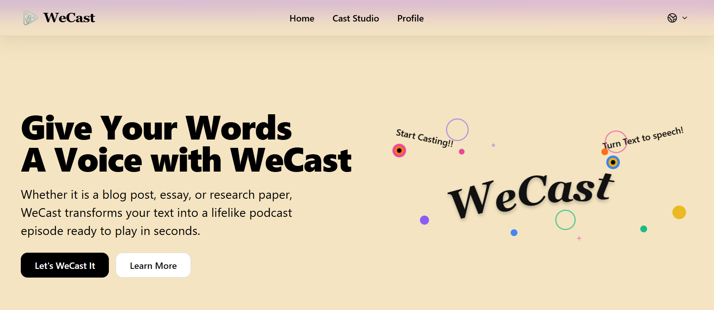
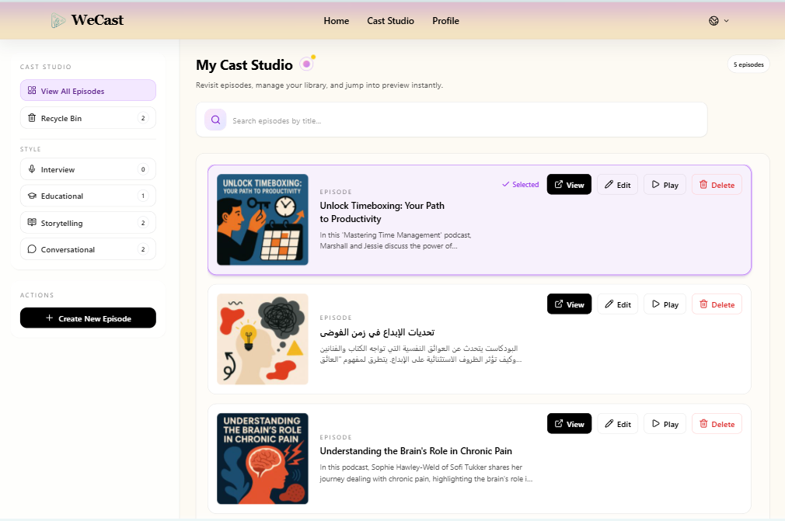
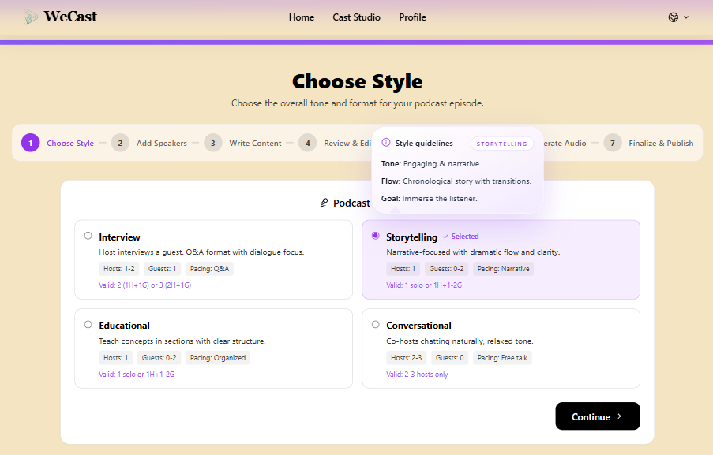
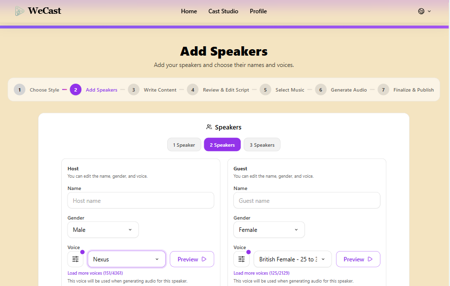
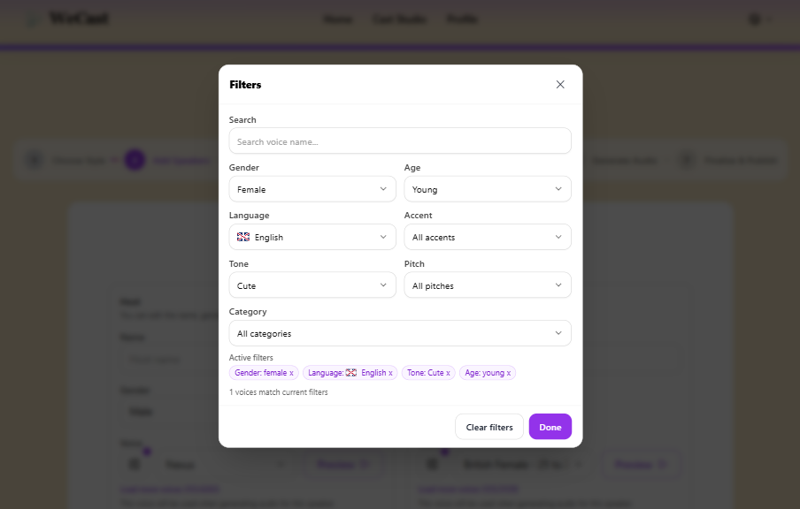
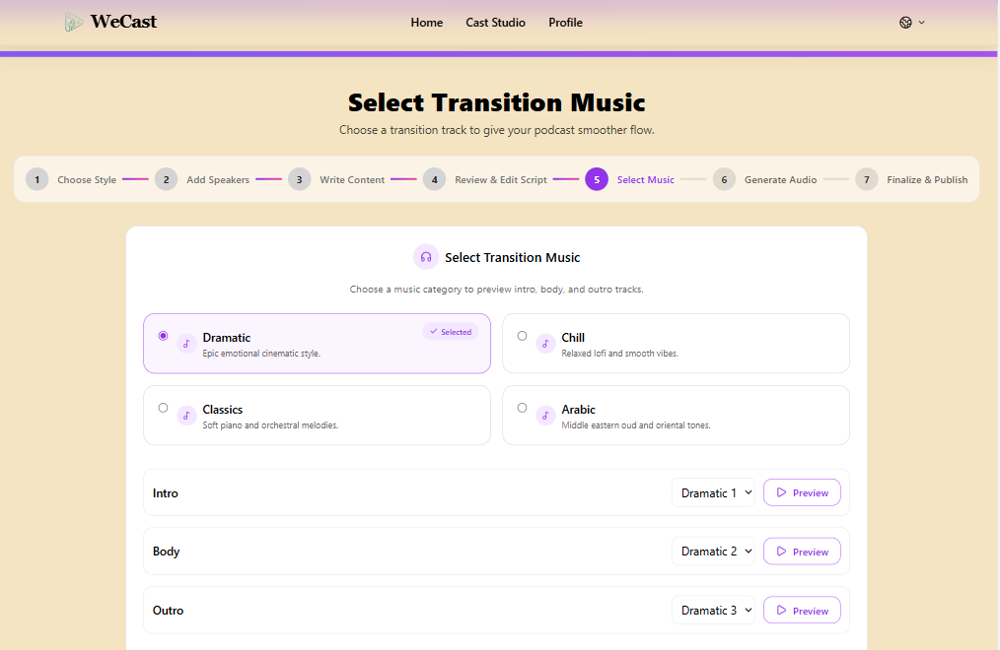
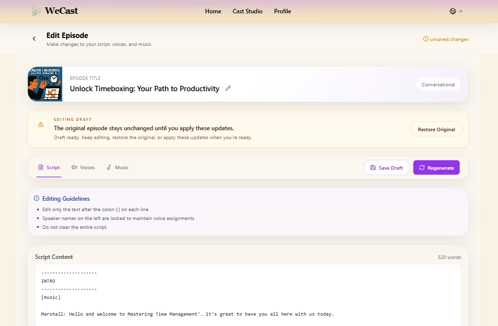
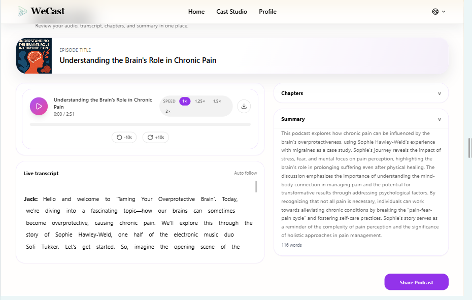
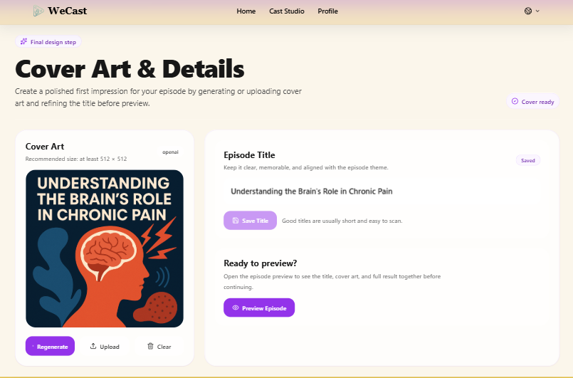

# 🎙️ WeCast

      

## Graduation Project Group 2

WeCast is an AI-powered podcast generation platform developed as the final software package for Graduation Project Group 2. It transforms written content into complete podcast episodes with generated scripts, realistic multi-speaker audio, transition music, cover art, transcripts, chapters, summaries, sharing, saved episodes, and download support.

## 📂 Software Package Structure

The submitted software package should include the following items:

```text
Submission Package
│
├── GP2_WeCast_Software/
├── GP2_WeCast_Executable
└── README.md
```

- `GP2_WeCast_Software/`: complete source code folder for the WeCast application.
- `GP2_WeCast_Executable`: packaged executable, startup script, or deployment entry used to launch the WeCast system.
- `README.md`: documentation file containing setup, run, testing, repository, and important notes.

## 🏗️ System Architecture

WeCast follows a client-server architecture:

- React frontend for user interaction
- Flask backend API for orchestration and AI processing
- Firestore database for structured application data
- Cloudflare R2 for generated media storage
- OpenAI and ElevenLabs APIs for AI-powered generation

## 📸 Screenshots

### Home Page



### Cast Studio Library



### Create Podcast



### Voice Selection





### Music Selection



### Edit Podcast



### Podcast Preview



### Cover Art / Final Output



## ✨ Key Features

- AI script generation from user-provided content
- Multi-speaker voice generation
- Transition music between podcast sections
- Interactive transcript display
- Automatically generated chapters and summaries
- Podcast cover art generation and upload
- Episode preview, sharing, and download features
- Saved podcast management for authenticated users

## 🛠️ Technologies Used

Frontend:

- React.js
- Vite
- Tailwind CSS
- Custom CSS

Backend:

- Flask
- Python
- OpenAI API
- ElevenLabs API
- FFmpeg
- pydub

Database and Storage:

- Firestore
- Firebase Authentication
- Cloudflare R2 object storage

Deployment:

- Render

## ✅ Prerequisites

Before running WeCast locally, ensure the following software is installed:

- Python 3.10 or newer
- Node.js and npm
- FFmpeg
- Git

## ⚙️ Installation Instructions

### 1. Clone the GitHub Repository

```bash
git clone https://github.com/GhalaMus/2025_GP_Group2.git
cd 2025_GP_Group2
```

If the submitted folder is named `GP2_WeCast_Software`, open that folder instead:

```bash
cd GP2_WeCast_Software
```

### 2. Install Backend Dependencies

Create and activate a Python virtual environment, then install the backend requirements:

```bash
python -m venv .venv
```

On Windows PowerShell:

```powershell
.\.venv\Scripts\Activate.ps1
pip install -r requirements.txt
```

On macOS or Linux:

```bash
source .venv/bin/activate
pip install -r requirements.txt
```

### 3. Install Frontend Dependencies

```bash
cd static/frontend
npm install
cd ../..
```

### 4. Set Up Environment Variables

Create a `.env` file in the project root for backend configuration. Also configure frontend environment variables in `static/frontend/.env` when required by the deployment or local setup.

## ▶️ Run Instructions

Backend:

```bash
python app.py
```

Frontend:

```bash
npm run dev
```

Open `http://localhost:5173`. By default, the backend runs at `http://127.0.0.1:5000`.

## 🔐 Environment Variables

The following variables are examples of the required configuration values. Use placeholders during documentation and replace them only in local `.env` files or secure deployment settings.

```env
OPENAI_API_KEY=your_openai_api_key
ELEVENLABS_API_KEY=your_elevenlabs_api_key

FIREBASE_PROJECT_ID=your_project_id
FIREBASE_STORAGE_BUCKET=your_storage_bucket

RESEND_API_KEY=your_resend_api_key
SMTP_HOST=your_smtp_host
SMTP_USER=your_smtp_user
SMTP_PASS=your_smtp_password

FRONTEND_PUBLIC_URL=your_frontend_public_url
WECAST_APP_URL=your_wecast_app_url
```

Frontend Firebase variables may also be required:

```env
VITE_FIREBASE_API_KEY=your_firebase_api_key
VITE_FIREBASE_AUTH_DOMAIN=your_firebase_auth_domain
VITE_FIREBASE_PROJECT_ID=your_project_id
VITE_FIREBASE_STORAGE_BUCKET=your_storage_bucket
VITE_FIREBASE_MESSAGING_SENDER_ID=your_messaging_sender_id
VITE_FIREBASE_APP_ID=your_firebase_app_id
VITE_API_BASE_URL=your_backend_api_url
```

If object storage is configured separately for generated media, add the relevant storage provider variables in the secure backend environment.

## 🧪 Testing Information

Use the following placeholder demo credentials for submission testing if final public credentials or URLs are not available:

```text
Email: test@example.com
Password: Test@12345
Frontend URL: [add deployed frontend URL]
Backend URL: [add deployed backend URL]
```

Suggested testing checklist:

- Generate script
- Generate audio
- Preview podcast
- Share podcast
- Download podcast

## 🔗 Official Repository

```text
https://github.com/GhalaMus/2025_GP_Group2
```

## ⚠️ Known Limitations

- AI generation depends on third-party API availability, billing status, and quota limits.
- Audio generation performance may vary depending on internet connection and hardware resources.
- Some advanced features require valid cloud service configuration.
- Email delivery requires correct Resend or SMTP settings.

## 📝 Important Notes

- Keep API keys, `.env` files, Firebase service account files, and provider credentials out of Git.
- Configure production secrets through the hosting provider dashboard or secure environment settings.
- If ports are changed, update the frontend API base URL and backend CORS/frontend-origin configuration accordingly.
